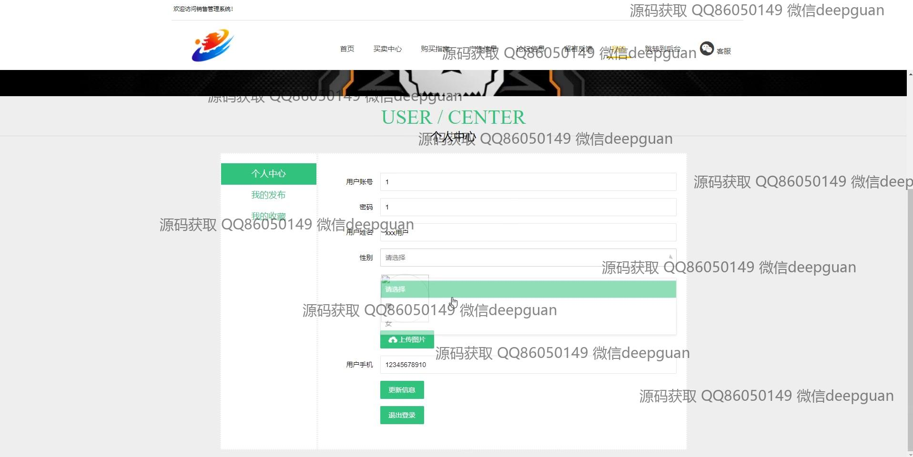
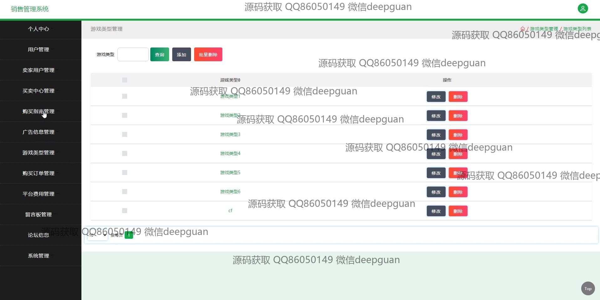
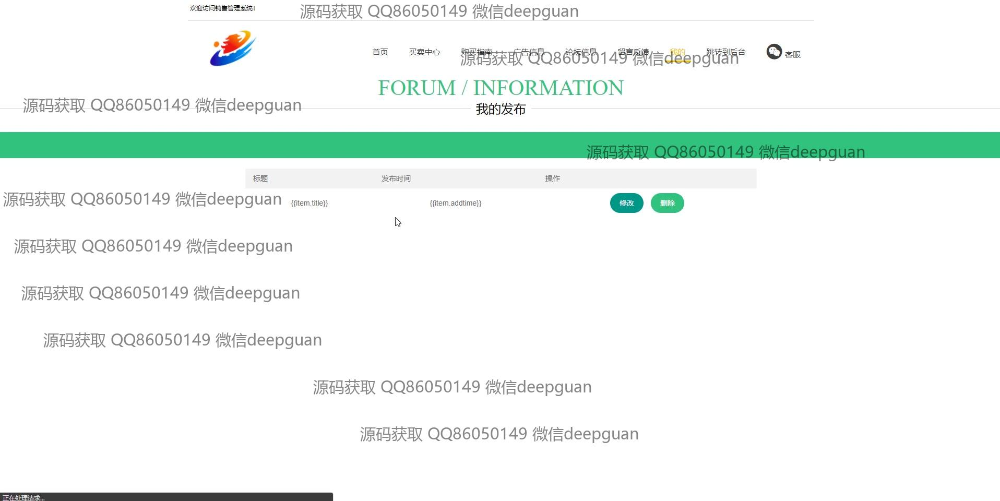

<h1 align="center">端游账号销售管理系统</h1>

## 简介
端游账号销售管理系统：角色分为管理员、用户和卖家用户；功能包括用户管理、账号管理、订单管理、数据统计、论坛信息管理和留言板管理，支持账号购买、评价及后台管理等操作。    --计算机毕业设计源码；毕设源码；java毕业设计源码

## 联系方式

<h3 align="center">获取完整代码与数据库文件 + 微信：deepguan QQ: 86050149 QQ群: 783742310</h3>

<h3 align="center">可帮忙远程部署 包运行成功！提供远程部署、修改代码、设计文档指导、代码讲解等服务！</h3>

## 功能介绍（完整见运行截图）
管理员：具备用户、卖家、广告信息及留言板的管理功能，包括账号信息的增删改查、订单状态查看和销售数据统计。支持后台管理登录，提供论坛信息审核和回复操作，以及销售报表生成，便于优化运营策略。

用户：支持账号注册、登录、个人信息管理和订单查询。可浏览游戏账号信息，使用条件筛选工具进行快速搜索，并查看详细的账号信息，包括价格、游戏类型及角色属性等。支持购买、评价和留言操作，提升用户体验。

卖家用户：提供账号发布和管理功能，可添加、修改、删除游戏账号信息。支持查看销售记录和订单状态，方便及时响应买家需求。具备个人中心功能，可管理账户信息、发布广告及处理用户留言。

游客：无需登录即可浏览商品信息，查看账号列表及购买指南。可通过筛选工具快速了解游戏账号的分类和价格范围，帮助初步了解系统功能及购买流程。

## 运行截图

本代码来源于网络,仅供学习参考使用!

